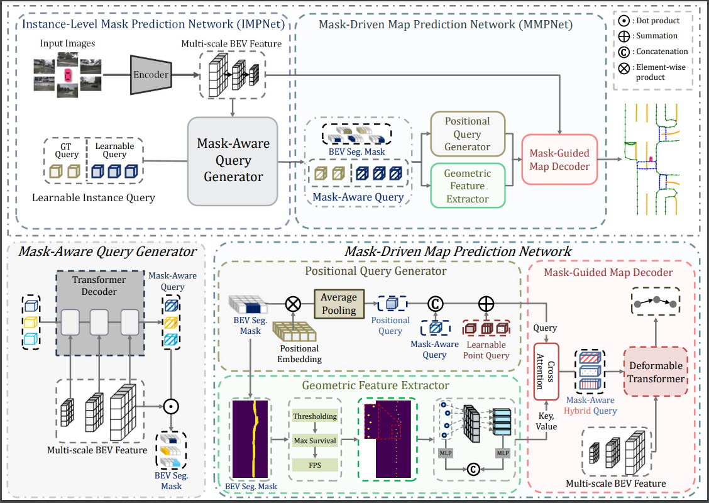

<div align="center">
<h1>[ECCV24] Mask2Map </h1>
<h3>Vectorized HD Map Construction Using Bird’s Eye View Segmentation Masks</h3>

Sewhan Choi<sup>1</sup> \*, Jungho Kim<sup>1</sup> \*, Hongjae Shin<sup>1</sup>, Junwon Choi<sup>2</sup> \**
 
<sup>1</sup> Hanyang University, Korea <sup>2</sup> Seoul National University, Korea

(\*) equal contribution, (<sup>**</sup>) corresponding author.

ArXiv Preprint ([arXiv 2208.05736](https://arxiv.org/abs/2308.05736))
<!-- [ECCV'24](??) -->

</div>


## Introduction



In this paper, we introduce Mask2Map, a novel end-to-end online HD map construction method designed for autonomous driving applications. Our approach focuses on predicting the class and ordered point set of map instances within a scene, represented in the bird's eye view (BEV).
Mask2Map consists of two primary components: the Instance-Level Mask Prediction Network (IMPNet) and the Mask-Driven Map Prediction Network (MMPNet). IMPNet generates Mask-Aware Queries and BEV Segmentation Masks to capture comprehensive semantic information globally. Subsequently, MMPNet enhances these query features using local contextual information through two submodules: the Positional Query Generator (PQG) and the Geometric Feature Extractor (GFE). PQG extracts instance-level positional queries by embedding BEV positional information into Mask-Aware Queries, while GFE utilizes BEV Segmentation Masks to generate point-level geometric features.
However, we observed limited performance in Mask2Map due to inter-network inconsistency stemming from different predictions to Ground Truth (GT) matching between IMPNet and MMPNet. To tackle this challenge, we propose the Inter-network Denoising Training method, which guides the model to denoise the output affected by both noisy GT queries and perturbed BEV Segmentation Masks.

## Models
> Results from the [Mask2Map paper](https://arxiv.org/abs/2308.05736)

## Qualitative results on nuScenes val split 

<div align="center"><h4> nuScenes dataset</h4></div>


| Method | Backbone | BEVEncoder |Lr Schd | mAP| config | Download_phase1 | Download_phase2 |
| :---: | :---: | :---: | :---: |  :---: |:----------------------------------------------------------------------------------------------------------------------------:|:-------------------------------------------------------------------------------------------------------------------------------------------------------------------------------------------------------:|:---------------:|
| Mask2Map| R50 |bevpool | 24ep | 71.6 | [config](https://github.com/SehwanChoi0307/Mask2Map/tree/main/projects/configs/mask2map/M2M_nusc_r50_full_2Phase_12n12ep.py) | [model_phase1](https://drive.google.com/file/d/1yWyYR-8HD6Ias5EdrfzDNbPMHcbV4jIZ/view?usp=sharing) | [model_phase2](https://drive.google.com/file/d/1eNwGSGAmHYip0nWjEb-HCYFiglLwTajW/view?usp=sharing) | 
| Mask2Map| R50 |bevpool | 110ep | 75.4 | [config](https://github.com/SehwanChoi0307/Mask2Map/tree/main/projects/configs/mask2map/M2M_nusc_r50_full_2Phase_55n55ep.py) | [model_phase1](https://drive.google.com/file/d/1Jbjhjl1n9vY05MSuGS-cMEcM2Ck_AoFP/view?usp=sharing) | [model_phase2](https://drive.google.com/file/d/1SpZhat0T9Hq0pZQrHOAgVuru3O8eZyId/view?usp=sharing) |

**Notes**: 
- All the experiments are performed on 4 NVIDIA GeForce RTX 3090 GPUs. 

## Getting Started
- [Installation](docs/install.md)
- [Prepare Dataset](docs/prepare_dataset.md)
- [Train and Eval](docs/train_eval.md)


## Demo


## Acknowledgements

Mask2Map is based on [mmdetection3d](https://github.com/open-mmlab/mmdetection3d). It is also greatly inspired by the following outstanding contributions to the open-source community: [MapTR](https://github.com/hustvl/MapTR), [BEVFusion](https://github.com/mit-han-lab/bevfusion), [BEVFormer](https://github.com/fundamentalvision/BEVFormer), [HDMapNet](https://github.com/Tsinghua-MARS-Lab/HDMapNet), [GKT](https://github.com/hustvl/GKT), [VectorMapNet](https://github.com/Mrmoore98/VectorMapNet_code).

## Citation
If you find Mask2Map is useful in your research or applications, please consider giving us a star 🌟 and citing it by the following BibTeX entry.
```bibtex
@inproceedings{Mask2Map,
  title={Mask2Map: Vectorized HD Map Construction Using Bird’s Eye View Segmentation Masks},
  author={Choi, Sewhan and Kim, Jungho and Shin, Hongjae and Choi, Jun Won},
  booktitle={European Conference on Computer Vision},
  year={2024}
}
```
